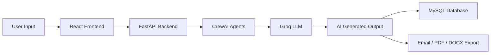
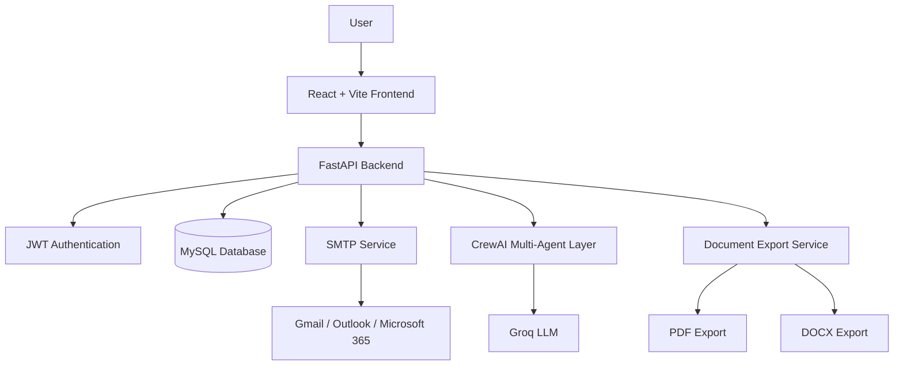

<div align="center">

# 🚀 Operations Agent

### AI-Powered Operations & Communication Automation Platform


<br><br>

**Operations Agent** is a full-stack AI platform that automates business communication, email workflows, daily reports, meeting notes, task tracking, and document generation.

</div>

---

## 📌 Project Overview

Operations Agent helps business and operations teams reduce manual communication work using AI.

It can generate professional emails, send personalized bulk emails from Excel files, create daily reports, generate meeting MOMs, manage tasks, export documents, and track email history through a clean dashboard.

---

## ✨ Key Features

<table>
<tr>
<td width="50%">

### ✉️ Single Email Generator

* AI-generated professional emails
* Tone selection
* Email preview
* Manual edit option
* Send email directly
* Email history tracking

</td>
<td width="50%">

### 📨 Bulk Email Sender

* Upload Excel file
* Generate personalized emails
* Customize using name/designation
* Preview before sending
* Bulk sending
* Bulk history tracking

</td>
</tr>

<tr>
<td width="50%">

### 📜 Email History

* Single email history
* Bulk email history
* Sent / Draft / Failed status
* Timestamp tracking
* Reopen old generated emails

</td>
<td width="50%">

### 📊 Email Analytics

* Total emails generated
* Sent email count
* Failed email count
* Draft tracking
* Communication insights

</td>
</tr>

<tr>
<td width="50%">

### 📝 Daily Report Generator

* Convert daily work updates into reports
* Professional formatting
* AI-generated summaries
* Export-ready output

</td>
<td width="50%">

### 📋 Meeting MOM Generator

* Convert meeting notes into MOM
* Extract decisions
* Extract action items
* Assign responsibilities
* Create follow-up tasks

</td>
</tr>

<tr>
<td width="50%">

### ✅ Task Tracker

* Create tasks
* Manage priority
* Track task status
* Generate reminder messages

</td>
<td width="50%">

### 📄 Document Export

* Export as PDF
* Export as DOCX
* Supports emails, reports, MOMs, and tasks

</td>
</tr>
</table>

---

## 🧠 How It Works



---

## 🏗️ System Architecture



---

## 🤖 AI Agent Architecture

| Agent                       | Responsibility                      |
| --------------------------- | ----------------------------------- |
| 🧠 Operations Manager Agent | Coordinates workflow between agents |
| ✉️ Communication Agent      | Generates professional emails       |
| 📋 Report Agent             | Creates daily reports               |
| 📝 Meeting Agent            | Generates MOM documents             |
| ✅ Task Agent                | Handles task-related workflows      |
| 📄 Document Agent           | Formats generated documents         |
| 🔔 Notification Agent       | Creates reminder messages           |

---

## 🛠️ Tech Stack

| Layer           | Technology                          |
| --------------- | ----------------------------------- |
| Frontend        | React 18, Vite, React Router, Axios |
| Backend         | FastAPI, Python, Pydantic           |
| Database        | MySQL, SQLAlchemy                   |
| AI Framework    | CrewAI                              |
| LLM             | Groq API                            |
| Authentication  | JWT                                 |
| Email           | SMTP                                |
| Document Export | python-docx, ReportLab              |

---

## 📁 Project Structure

```text
operations-agent/
│
├── backend/
│   ├── app/
│   │   ├── crews/
│   │   ├── routes/
│   │   ├── services/
│   │   ├── tools/
│   │   ├── models.py
│   │   ├── schemas.py
│   │   ├── database.py
│   │   ├── auth.py
│   │   └── main.py
│   │
│   ├── requirements.txt
│   └── .env.example
│
├── frontend/
│   ├── src/
│   │   ├── pages/
│   │   ├── components/
│   │   ├── App.jsx
│   │   └── api.js
│   │
│   ├── package.json
│   └── vite.config.js
│
└── README.md
```

---

## 📊 Main Modules

| Module                 | Description                            |
| ---------------------- | -------------------------------------- |
| Dashboard              | Shows statistics and recent activities |
| Single Email Generator | Generates and sends AI emails          |
| Bulk Email Sender      | Sends personalized emails from Excel   |
| Email History          | Tracks single and bulk email records   |
| Email Templates        | Stores reusable email formats          |
| Email Analytics        | Shows email performance metrics        |
| Daily Report           | Generates professional daily reports   |
| Meeting MOM            | Creates Minutes of Meeting             |
| Task Tracker           | Manages operational tasks              |
| Email Settings         | Stores SMTP configuration              |

---

## 📥 Bulk Email Excel Format

Your Excel file should contain these columns:

| name       | email                                       | designation |
| ---------- | ------------------------------------------- | ----------- |
| John Doe   | [john@example.com](mailto:john@example.com) | CEO         |
| Jane Smith | [jane@example.com](mailto:jane@example.com) | HR Manager  |

The AI uses these details to personalize every email.

---

## 🚀 Installation Guide

### 1️⃣ Clone Repository

```bash
git clone https://github.com/abhijitdas12679/operations-agent.git
cd operations-agent
```

---

## ⚙️ Backend Setup

```bash
cd backend
python -3.11 -m venv venv
```

### Windows

```bash
venv\Scripts\activate
```

### Mac / Linux

```bash
source venv/bin/activate
```

Install dependencies:

```bash
pip install -r requirements.txt
```

---

## 🔐 Environment Setup

Create this file:

```text
backend/.env
```

Add your configuration:

```env
GROQ_API_KEY=your_groq_api_key_here

MYSQL_HOST=localhost
MYSQL_PORT=3306
MYSQL_USER=root
MYSQL_PASSWORD=your_mysql_password
MYSQL_DATABASE=operations_agent

JWT_SECRET_KEY=your_secret_key_here
ACCESS_TOKEN_EXPIRE_MINUTES=60
```

---

## 🗄️ MySQL Database Setup

```sql
CREATE DATABASE operations_agent;
```

---

## ▶️ Run Backend

```bash
uvicorn app.main:app --reload
```

Backend URL:

```text
http://localhost:8000
```

Swagger API Docs:

```text
http://localhost:8000/docs
```

---

## 🎨 Frontend Setup

```bash
cd frontend
npm install
npm run dev
```

Frontend URL:

```text
http://localhost:5173
```

---

## 🔑 SMTP Setup

Supported providers:

* Gmail
* Outlook
* Microsoft 365

For Gmail, use an **App Password**, not your normal Gmail password.

---

## 🔒 Security Features

* JWT authentication
* Password hashing
* Protected frontend routes
* Protected backend APIs
* User-based email history
* Encrypted SMTP credentials
* `.env` ignored from GitHub

---

## 📌 Use Cases

| User Type       | Usage                             |
| --------------- | --------------------------------- |
| Operations Team | Automate daily communication      |
| HR Team         | Send bulk employee emails         |
| Project Manager | Generate reports and MOMs         |
| Sales Team      | Send personalized outreach emails |
| Admin Team      | Track tasks and communication     |

---

## 🧪 API Testing

Open Swagger:

```text
http://localhost:8000/docs
```

Common endpoints:

| Method | Endpoint                | Description                           |
| ------ | ----------------------- | ------------------------------------- |
| POST   | `/auth/register`        | Register user                         |
| POST   | `/auth/login`           | Login user                            |
| POST   | `/email/generate`       | Generate single email                 |
| GET    | `/email/history`        | Get email history                     |
| POST   | `/email/bulk/upload`    | Upload Excel and generate bulk emails |
| POST   | `/email/bulk/send`      | Send bulk emails                      |
| POST   | `/report/generate`      | Generate daily report                 |
| POST   | `/meeting/generate-mom` | Generate MOM                          |
| POST   | `/tasks/create`         | Create task                           |
| GET    | `/dashboard/stats`      | Dashboard statistics                  |

---

## 🛣️ Future Enhancements
 
* Email scheduling
* Email open tracking
* Email click tracking
* Calendar integration
* CRM integration
* WhatsApp notifications
* Advanced analytics dashboard
* AI follow-up email generation
* Multi-tenant support

---

## 👨‍💻 Author

<div align="center">

### Abhijit Das

**Operations & Communication Automation Platform**

Built with ❤️ using **FastAPI**, **React**, **CrewAI**, **Groq**, and **MySQL**

</div>

---

<div align="center">

⭐ If you like this project, consider starring the repository.

</div>
